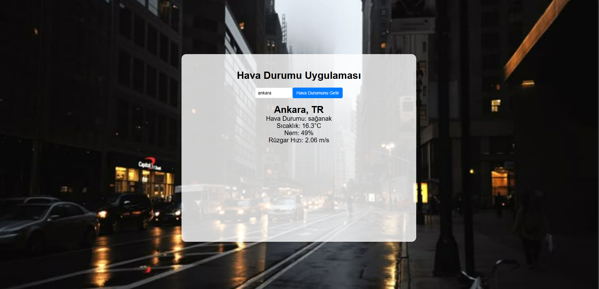

# WeatherAppAPI
# Hava Durumu Uygulaması (API ile)

Bu proje, kullanıcının girdiği şehir adı ile hava durumu bilgilerini OpenWeatherMap API'si üzerinden alarak görüntüleyen bir uygulamadır. Uygulama, hava durumu bilgisini Türkçe olarak, sıcaklık, nem oranı ve rüzgar hızı gibi verileri kullanıcıya sunar.

## Özellikler
- Şehir adı girilerek hava durumu sorgulanabilir.
- Uygulama, kullanıcıya hava durumu açıklamasını, sıcaklık bilgisini, nem oranını ve rüzgar hızını gösterir.
- Temel olarak bir görsel arka plan kullanılır (`asd.png`).
- Hava durumu bilgisi, şehri girdikten sonra kullanıcıya görsel olarak sunulur.
- Input alanı ve buton tasarımı özelleştirilmiş olup, arka plan görseli ve uygulama genişliği de ayarlanmıştır.

## Teknolojiler
- HTML5
- CSS3
- JavaScript (API entegrasyonu için)
- OpenWeatherMap API

## Nasıl Çalışır?
1. **API Anahtarınızı Alın**: OpenWeatherMap API'sine kaydolun ve bir API anahtarı edinin. (API anahtarınızı almak için [OpenWeatherMap](https://openweathermap.org/) sitesine gidin)
2. **Anahtarınızı Kodda Kullanın**: `script.js` dosyasındaki `YOUR_API_KEY` kısmını kendi API anahtarınızla değiştirin.
3. **Uygulamayı Başlatın**: `index.html` dosyasını bir tarayıcıda açarak uygulamayı çalıştırabilirsiniz.

## Kullanım Adımları
1. **Şehir Adı Girin**: Uygulamanın üst kısmındaki "Şehir Girin" kutusuna istediğiniz şehri yazın.
2. **Hava Durumunu Göster**: "Hava Durumunu Göster" butonuna tıklayın.
3. **Hava Durumu Bilgilerini Görün**: Hava durumu bilgileri, şehre ait sıcaklık, nem oranı ve rüzgar hızı bilgileri ekranın alt kısmında gösterilecektir.

## Dosya Yapısı
WeatherAppAPI/ │ 
├── index.html # Ana HTML dosyası 
├── style.css # Uygulamanın stil dosyası 
├── script.js # JavaScript dosyası 
├── asd.png # Arka plan görseli

## 🖼️ Arayüz Görünümü

| Açık Tema | Karanlık Tema |
|----------|----------------|
|  | 
